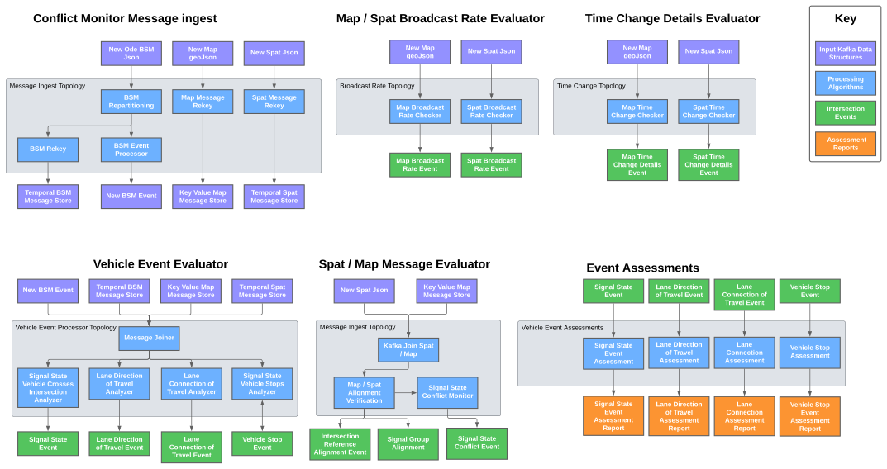

# jpo-conflictmonitor

The JPO Conflict Monitor is a real time validation system to verify corresponding SPAT, MAP and BSM messages. Validation is done by aggregating input messages, then performing appropriate analysis to establish and detect vehicle events for an intersection. Detected Events are published to Kafka Topics to be stored for further analysis. 



The conflict monitor is focused on validating messages (SPaT, MAP and BSM) against one another to develop a picture of what is happening at a given intersection. In particular, the conflict monitor is looking for state information which is not self consistent and is likely the function of incorrect message generation and broadcasting. The conflict monitor is not configurted to validate message structure, as this functionallity is performed by the jpo-geojsonconverter.

All stakeholders are invited to provide input to these documents. To provide feedback, we recommend that you create an "issue" in this repository (<https://github.com/usdot-jpo-ode/jpo-conflictmonitor/issues>). You will need a GitHub account to create an issue. If you don’t have an account, a dialog will be presented to you to create one at no cost.

---

<a name="toc"/>

## Table of Contents

1.  [Usage Example](#usage-example)
2.  [Configuration](#configuration)
3.  [Installation](#installation)
4.  [File Manifest](#file-manifest)
5.  [Development Setup](#development-setup)
6.  [Deployment](#deployment)
7.  [Contact Information](#contact-information)
8.  [Contributing](#contributing)
<!--
#########################################
############# Usage Example #############
#########################################
 -->

<a name="usage-example"/>

## 1. Usage Example

The jpo-conflict monitor uses JSON encoded ODE BSM data, along with the processed SPaT and MAP messages from the geojsonconverter to validate intersection performance. Data is partitioned based upon the receiving device (generally the RSU at an intersection) to ensure scalable performance. In order to verify your jpo-conflictmonitor is functioning, you must run the jpo-ode, the jpo-geojsonconverter and the jpo-conflictmonitor and then send the jpo-ode raw ASN1 encoded MAP, SPaT and BSM data through the ODE to validate performance.

Follow the configuration section to properly configure and launch your jpo-ode, jpo-geojsonconverter, and jpo-conflictmonitor.

[Back to top](#toc)

<!--
#########################################
############# Configuration #############
#########################################
 -->

<a name="configuration"/>

## 2. Configuration

### System Requirements

Recommended machine specs running Docker to run the GeoJsonConverter:
-  Minimum RAM: 16 GB
-  Minimum storage space: 100 GB
-  Supported operating systems:
   -  Ubuntu 18.04 Linux (Recommended)
   -  Windows 10 Professional (Professional version required for Docker virtualization)
   -  OSX 10 Mojave

The ConflictMonitor software can run on most standard Window, Mac, or Linux based computers with
Pentium core processors. Performance of the software will be based on the computing power and available RAM in
the system.  Larger data flows can require much larger space requirements depending on the
amount of data being processed by the software. The JPO-ConflictMonitor software application was developed using the open source programming language Java. If running the JPO-ConflictMonitor outside of Docker, the application requires the Java 11 runtime environment.

### Software Prerequisites

The JPO-ConflictMonitor is a micro service that runs as an independent application within an existing Apache Kafka System. The JPO-conflictmonitor takes advantages of multiple data models defined in the jpo-geojsonconverter and jpoode. These are included into the Conflict Monitor as submodules, and must be run independently to ensure proper operation. The JPO-ODE in particular is still required to launch Kafka, Zookeeper, the ASN1 decoder and create the required Kafka topics. All other required dependencies will automatically be downloaded and installed as part of the Docker build process.

- Docker: <https://docs.docker.com/engine/installation/>
- Docker-Compose: <https://docs.docker.com/compose/install/>

### Tips and Advice

Read the following guides to familiarize yourself with ConflictMonitors's Docker and the ODE managed Kafka modules.

- [Docker README](docker.md)
- [ODE Kafka README](https://github.com/usdot-jpo-ode/jpo-ode/blob/dev/kafka.md)
- [GEOJSON Converter README](https://raw.githubusercontent.com/usdot-jpo-ode/jpo-geojsonconverter/develop/README.md)

**Installation and Deployment:**

- Docker builds may fail if you are on a corporate network due to DNS resolution errors.
- Windows users may find more information on installing and using Docker [here](https://github.com/usdot-jpo-ode/jpo-ode/wiki/Docker-management).
- Users interested in Kafka may find more guidance and configuration options [here](docker/kafka/README.md).

**Configuration:**

The JPO-ConflictMonitor configuration is customized through the environment variables provided to Docker when Docker-Compose runs the Docker built JPO-ConflictMonitor image. This provides basic configuration on kafka items such as the kafka broker location. Individual process modules can be configured by modifing the properties files in the resource folder before building the docker image.

**Important!**
You must rename `sample.env` to `.env` for Docker to automatically read the file. Do not push this file to source control.

[Back to top](#toc)

<!--
########################################
############# Installation #############
########################################
 -->

<a name="installation"/>

## 3. Installation

The following instructions describe the minimal procedure to fetch, build, and run the main ConflictMonitor application.

#### Step 0

If running on Windows, please make sure that your global git config is set up to not convert end-of-line characters during checkout.

Disable `git core.autocrlf` (One Time Only)

```bash
git config --global core.autocrlf false
```

Enable Long Filepaths for Git
```bash
git config core.longpaths true
```

#### Step 1 - Download the Source Code

Note: if you intend to run the entire ConflictVisualizer system, you should instead start with [step 1 of the ConflictVisualizer Installation Guide](https://github.com/usdot-jpo-ode/jpo-conflictvisualizer?tab=readme-ov-file#1-initialize-and-update-submodules) before returning to step 2 below.

The jpo-geojsonconverter software system consists of the following modules hosted in separate Github repositories:

|Name|Visibility|Description|
|----|----------|-----------|
|[jpo-conflictmonitor](https://github.com/usdot-jpo-ode/jpo-conflictmonitor)|public|Contains the public components of the application code.|
|[jpo-geojsonconverter](https://github.com/usdot-jpo-ode/jpo-geojsonconverter)|public|Contains the public classes and libraries of the jpo-geojsonconverter used in the Conflict Monitor.|
|[jpo-ode](https://github.com/usdot-jpo-ode/jpo-ode)|public|Contains the public classes and libraries of the jpo-ode used in the Conflict Monitor.|

You may download the stable, default branch for ALL of these dependencies by using the following recursive git clone command:

```bash
git clone --recurse-submodules https://github.com/usdot-jpo-ode/jpo-conflictmonitor.git
```

Once you have these repositories obtained, you are ready to build and deploy the application.

#### Step 2 - Build and run jpo-ode application

Navigate to the root directory of the jpo-ode project and run the following command:

```bash
docker-compose up --build -d
docker-compose ps
```

Verify the jpo-ode, kafka, zookeeper, asn1-decoder and asn1-encoder are running before performing step 3.

#### Step 3 - Build and run jpo-geojsonconverter application

**Notes:**
- Docker builds may fail if you are on a corporate network due to DNS resolution errors.
- In order for Docker to automatically read the environment variable file, you must rename it from `sample.env` to `.env`. **This file will contain private keys, do not put add it to version control.**

Navigate to the root directory of the jpo-geojsonconverter project and run the following command:

```bash
docker-compose up --build -d
docker-compose ps
```

#### Step 4 - Build and run jpo-conflictmonitor application

**Notes:**
- Docker builds may fail if you are on a corporate network due to DNS resolution errors.
- In order for Docker to automatically read the environment variable file, you must rename it from `sample.env` to `.env`. **This file will contain private keys, do not put add it to version control.**

Navigate to the root directory of the jpo-conflictmonitor project and run the following command:

```bash
docker-compose up --build -d
docker-compose ps
```

To bring down the services and remove the running containers run the following command:

```bash
docker-compose down
```
For a fresh restart, run:

```bash
docker-compose down
docker-compose up --build -d
docker-compose ps
```

To completely rebuild from scratch, run:

```bash
docker-compose down
docker-compose rm -fvs
docker-compose up --build -d
docker-compose ps
```

## Environment variables

### Purpose & Usage

- The DOCKER_HOST_IP environment variable is used to communicate with the bootstrap server that the instance of Kafka is running on.

### Values
In order to utilize Confluent Cloud:

- DOCKER_HOST_IP must be set to the bootstrap server address (excluding the port)

[Back to top](#toc)
	
<!--
#########################################
############# File Manifest #############
#########################################
 -->

<a name="file-manifest"/>

## 4. File Manifest

This section outlines the software technology stacks of the GeoJsonConverter.

### Containerization and Management

- [Docker](https://www.docker.com/)
- [Docker-Compose](https://docs.docker.com/compose/)

### Messaging

- [Kafka](https://kafka.apache.org/)

### ODE Code

- [Java 11](https://openjdk.java.net/)
- [Maven](https://maven.apache.org/)
- [Spring Boot](http://spring.io/projects/spring-boot)
- [Logback](https://logback.qos.ch/)
- [SNMP4J](https://www.snmp4j.org/)
- [JUnit](https://junit.org)
- [JMockit](http://jmockit.github.io/)

[Back to top](#toc)

<!--
#############################################
############# Development Setup #############
#############################################
 -->

<a name="development-setup"/>

## 5. Development Setup

### Integrated Development Environment (IDE)

Install the IDE of your choice:

* Eclipse: [https://eclipse.org/](https://eclipse.org/)
* STS: [https://spring.io/tools/sts/all](https://spring.io/tools/sts/all)
* IntelliJ: [https://www.jetbrains.com/idea/](https://www.jetbrains.com/idea/)

### Continuous Integration

* TravisCI: <https://travis-ci.org/usdot-jpo-ode/jpo-ode>

[Back to top](#toc)

<a name="deployment"/>

## 6. Deployment

### Standard Deployment

* The standard deployment has the services provided by `docker-compose.yml` including a MongoDB container as well as the kafka-connector as well.

### Standalone Deployment

* The standalone deployment has the services provided by `docker-compose-standalone.yml` and is intended to only deploy the conflict monitor service with auto-restarting conditions. This deployment requires an existing MongoDB database as well as configurations for kafka connectors for an existing kafka-connector service.

### Release Deployment

* The release deployment has the services provided by `release-compose.yml` including a MongoDB container, Monitor Container and Connector container. This deployment references pre-built dockerfiles available on dockerhub, and can provide a streamlined deployment process using the latest formal release.

[Back to top](#toc)

<!--
###############################################
############# Contact Information #############
###############################################
 -->

<a name="contact-information"/>
## 7. Contact Information

Contact the developers of the GeoJsonConverter application by submitting a [Github issue](https://github.com/usdot-jpo-ode/jpo-geojsonconverter/issues).

### License information

Licensed under the Apache License, Version 2.0 (the "License"); you may not use this
file except in compliance with the License.
You may obtain a copy of the License at <http://www.apache.org/licenses/LICENSE-2.0>
Unless required by applicable law or agreed to in writing, software distributed under
the License is distributed on an "AS IS" BASIS, WITHOUT WARRANTIES OR CONDITIONS OF ANY KIND, either expressed or implied. See the License for the specific language governing
permissions and limitations under the [License](http://www.apache.org/licenses/LICENSE-2.0).

[Back to top](#toc)

<!--
########################################
############# Contributing #############
########################################
 -->

<a name="contributing"/>

## 8. Contributing

Please read our [contributing guide](docs/contributing_guide.md) to learn about our development process, how to propose pull requests and improvements, and how to build and test your changes to this project.

### Source Repositories - GitHub

- Main repository on GitHub (public)
	- <https://github.com/usdot-jpo-ode/jpo-conflictmonitor>
- USDOT GeoJsonConverter on Github (public)
	- <https://github.com/usdot-jpo-ode/jpo-geojsonconverter>
- USDOT ITS JPO ODE on Github (public)
	- <https://github.com/usdot-jpo-ode/jpo-ode>

[Back to top](#toc)