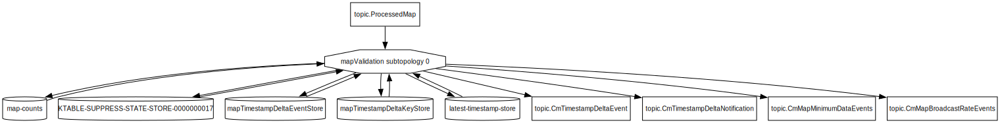
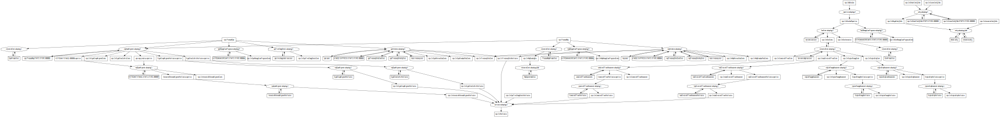
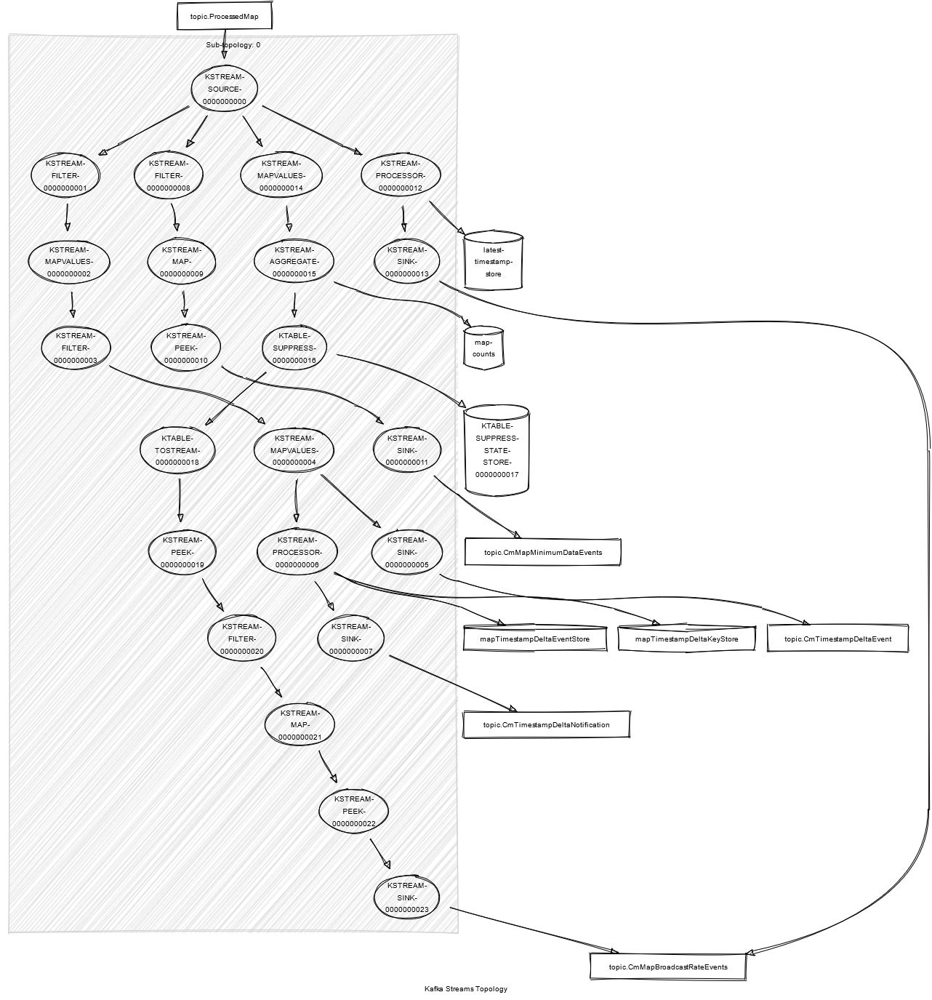

# Kafka Streams Visualization Tools

Endpoints for describing Kafka Streams internals are available at:

http://localhost:8082/health/topologies

with the Conflict Monitor running in Docker.

## Topology Overviews

The `topologies/simple` endpoints produce GraphViz `dot` files that represent the input and output topics of topologies, connections between topologies, and associated state stores.

To visualize the current state of all Kafka Streams download the `all.dot` file from:

http://localhost:8082/health/topologies/simple/all

To see a simple view of the inputs and outpus of a single topology select one of the `topologies/simple` endpoints, for example:

http://localhost:8082/health/topologies/simple/mapValidation

To create images from the dot files, install the GraphViz command line tool from:

https://graphviz.org/download/

and run the `dot` command, for example:

Create SVG:
```bash
dot -Tsvg all.dot > all.svg
```

Create PNG:
```bash
dot -Tpng all.dot > all.png
```

### Examples
#### MapValidation Topology Overview


#### Spat Validation Topology Overview


#### All Topologies Overview

Open the image in a separate tab to zoom in




## Topology Details

To view detailed internals for one topology select one of the `topologies/detail` endpoints, for example:

http://localhost:8082/health/topologies/detail/mapValidation

Save the response to a text file.  This file is the result of calling the Topology.describe() method.  This format can be visualized using the online Kafka Streams Topology Visualizer here:

https://zz85.github.io/kafka-streams-viz/

#### Example: MAP Validation Topology Details



